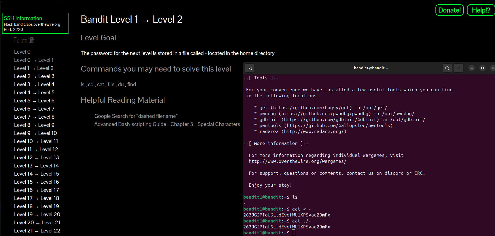

# Bandit Level 1 → Level 2

### Goal
The password for the next level is stored in a file called `-` located in the home directory.

### Solution
In Linux, the dash `-` can be tricky because commands might think it's a flag (option). To read it, you need to specify the path.

1. **List files:**
   ```bash
   ls
   cat < -
   # OR
   cat ./-  

Password for Level 2  
263GJPfgU6LtdEvgfWU1XP5yac29mFx  


### Screenshot

