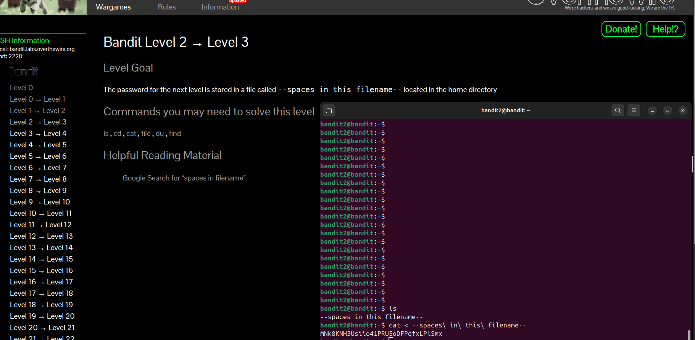

# Bandit Level 2 → Level 3

### Goal
The password for the next level is stored in a file called `spaces in this filename` located in the home directory.

### Solution
In Linux, if a filename contains spaces, the terminal will treat each word as a separate argument. To fix this, you must either use quotes or escape the spaces.

1. **List files:**
```bash
ls


Read the file:
You can use either of these commands:


cat "spaces in this filename"
# OR
cat spaces\ in\ this\ filename


Password for Level 3
MNk8KNH3Usiio41PRUEoDFPqfxLPlSmx

```

### Screenshot

